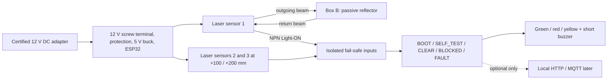

# Garage Beam Safety

> 8 September: [optical hardware, exact sensor buying links and native-library status](docs/OPTICAL_HARDWARE.html).
> Selected optical pair: Omron E3Z-T61 2M (separate emitter and receiver).
> Open `hardware/altium/04_Optical_Heads.SchDoc` and `hardware/altium/lib/OpticalHardware.SchLib`.
> Receiver terminals J2/J3/J4/J6 now use Phoenix 1715734 with matching STEP; sensor-head STEP remains unavailable.
> The older PCB still needs other component/library repairs and routing. Not manufacturing-ready.

> Historical 7 September: [component and external-power audit](docs/COMPONENT_AND_POWER_AUDIT.html).
> The native mounting overview now includes both external AC/DC adapters.
> Exact sensors, their CAD and the 10 mm versus 100 mm mounting dimension remain unresolved.

> Current direction: powered through-beam heads on opposite walls, 12V adapters,
> a 5V buck for the ESP32, and a visible RGB strip with no buzzer.
> See [current design](docs/CURRENT_DESIGN.html) and [RGB indicator update](docs/RGB_INDICATOR.html).
> The retroreflective D3 description below is historical. Native libraries and
> PCB/3D are incomplete; this repository is not manufacturing-ready.

Fail-safe, advisory ESP32 garage-door clearance detector using three narrow optical beams at 100 mm vertical centres. Version 1 never operates the garage door and never replaces its manufacturer's safety devices.

## Current draft outcome

The D3 architecture puts the ESP32 controller and three powered retroreflective laser sensors on one garage wall. A matching passive carrier holds three reflectors on the opposite wall. Both carriers use 100 mm vertical centres. This directly addresses difficult cross-garage wiring, but the retroreflective arrangement is provisional until glossy vehicle surfaces are proven unable to produce a false CLEAR.

The opposed-beam alternative uses a transmitter on one wall and receiver/controller on the other. It removes the retroreflection false-clear concern but requires power or cable routing to both walls.

## Safety semantics

- Green means every enabled beam has continuously proved clear for at least 500 ms.
- Red means a beam is blocked or its simple three-wire input is open/unpowered.
- Yellow means boot, self-test, an active diagnostic failure, or unknown state.
- Network availability never participates in this decision.
- With the proposed NPN Light-ON wiring, current must flow to earn CLEAR. Open cable, unplugged sensor, lost sensor power, or broken optocoupler input goes unsafe.
- A three-wire single output cannot distinguish blockage from every fault and cannot detect a signal shorted permanently to 0 V. The PCB reserves per-channel power proof testing to improve this in D1.

## Repository

- `hardware/altium/` — authoritative four-sheet native Altium schematic, controller PCB,
  reflector-carrier PCB, and ActiveBOM.
- `hardware/altium/ALTIUM_QUICK_REFERENCE.html` — dark-theme schematic, PCB,
  layer, routing, 3D-view, and project-update command guide.
- `hardware/DESIGN_SPEC.md` — D3 electrical architecture, channel circuit, pins, and PCB constraints.
- `hardware/PCB_SPEC.md` — exact controller and reflector-carrier outlines and 100 mm beam datums.
- `hardware/manufacturing/bom/BOM_DRAFT.csv` — retired historical draft; the
  native Altium `GarageBeamSafety.BomDoc` is authoritative.
- `firmware/` — PlatformIO/Arduino local state-machine prototype and tests.
- `docs/PROTOTYPE_WIRING.md` — USB-powered three-beam prototype wiring.
- `docs/OPTICAL_VALIDATION.md` — repeatability, reflective-surface, lighting, and acceptance tests.
- `docs/PROCUREMENT.md` — sensor choices and current supplier/search links.
- `mechanical/` — reserved for measured enclosure and adjustment models.

## Draft limits

Do not order a PCB or depend on this system for the 10 mm clearance yet. D3 now
has native Altium schematic, a compact 110 x 85 mm controller placement,
reflector carrier, and ActiveBOM documents, but the controller PCB intentionally
remains unrouted and still requires verified manufacturer footprints and STEP
models, schematic-to-PCB synchronization, ERC, routing, and DRC. The
copied EnergyMeter files are isolated template references only under
`hardware/altium/template-source`.

The next release step needs: wall-to-wall optical span; lowest required beam height; photographs and dimensions of both mounting zones; exact ESP32 DevKit dimensions; confirmation of the selected 5.08 mm power terminal; sensor/reflector mounting-hole details; and the maximum permitted carrier/enclosure dimensions.
